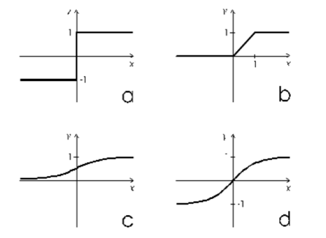

# Inhoud

1. [Introductie tot machine learning](#IntroductionToMachineLearning)
    1. [Supervised learning](#supervised_learning)
    2. [Unsupervised learning](#unsupervised_learning)
    3. [Learning with reinforcement](#learning_with_reinforcement)
2. [Wat is Deep Learning?](#what_is_deep_learning)
    1. [Hoe werkt het menselijk brein?](#how_the_human_brain_works)
    2. [Neurale netwerken](#neural_networks)
    3. [Het biologische neuron](#the_biological_neuron)
    4. [Het artificiële neuron](#the_artificial_neuron)
3. [Hoe leert een artificieel neuraal netwerk?](#neural_network_learning)
    1. [Het backpropagation algoritme](#backpropagation_algorithm)
    2. [Optimalisatie van de gewichten](#weights_optimization)
    3. [Stochastic Gradient Descent](#stochastic_gradient_descent)

 

# Deep Learning met TensorFlow

## Introductie tot machine learning

Machine learning is een onderzoeksdomein van de computerwetenschappen, dat zich bezighoudt met methoden voor het identificeren en implementeren van systemen en algoritmen, waardoor een computer kan leren op basis van voorbeelden die als input worden gegeven.

De uitdaging van machine learning is om een computer te laten leren hoe automatisch patronen worden herkend en beslissingen kunnen worden genomen, die zo intelligent mogelijk zijn. Het hele leerproces vereist een dataset als volgt:

 * **Training set**: dit is de kennisbank die wordt gebruikt om het machine learning algoritme te trainen. Tijdens deze fase kunnen de parameters van het machine learning model worden afgestemd op basis van de verkregen prestaties.
 
  * **Testing data**: dit wordt alleen gebruikt voor het evalueren van de prestaties van het model op nog niet geëvalueerde data.
  
De leertheorie gebruikt wiskundige hulpmiddelen, die zijn afgeleid van de **waarschijnlijkheidstheorie** en de **informatietheorie**. Hiermee kunt u de optimaliteit van sommige methiden ten opzichte van andere beoordelen.

Er zijn in principe drie leerparadigma's die kort zullen worden besproken:

* [Supervised learning](#supervised_learning)
* [Unsupervised learning](#unsupervised_learning)
* [Learning with reinforcement](#learning_with_reinforcement)

## Supervised learning

**Supervised learning** is een automatische leertaak. Het is gebaseerd op een aantal vooraf geclassificeerde voorbeelden, waartoe de categorie van elk van de ingangen die als voorbeeld wordt gebruikt, moet behoren. In dit geval is de cruciale hinderpaal het probleem van **generalisatie**. Na de analyse van een aantal voorbeelden, zou het systeem een ​​model moeten produceren dat goed zou moeten werken voor elke mogelijke input.

De set bestaat uit gelabelde gegevens; dat wil zeggen objecten en de bijbehorende klassen. Deze set gelabelde voorbeelden vormt daarom de trainingsset.

De meeste begeleide leeralgoritmen hebben één kenmerk gemeen: de training wordt uitgevoerd door het minimaliseren van een bepaalde verlies- of kostenfunctie, die de outputfout bepaalt, die door het systeem wordt gegenereerd in relatie tot de gewenste output. De trainingsset biedt ons immers de gewenste output.

Het systeem wijzigt vervolgens zijn interne bewerkbare parameters, de gewichten om deze foutfunctie te minimaliseren. De kwaliteit van het model wordt geëvalueerd en biedt een tweede set gelabelde voorbeelden (de testset), waarbij het percentage correct geclassificeerde voorbeelden en het percentage verkeerd geclassificeerde voorbeelden wordt geëvalueerd.

De begeleide leercontext omvat de *classifiers*, maar ook het leren van functies die numerieke waarden voorspellen. Deze leertaak is de **regressie**. In een regressieprobleem is de trainingsset een paar gevormd door een object en de bijbehorende numerieke waarde. Er zijn verschillende begeleide leeralgoritmen die zijn ontwikkeld voor classificatie en regressie. Deze kunnen worden gegroepeerd in de formule, die wordt gebruikt om onder meer de classifier of de leervoorspeller te vertegenwoordigen, zoals beslissingsbomen, beslissingsregels, neurale netwerken en Bayesiaanse netwerken.

## Unsupervised learning

Bij onbegeleid leren (unsupervised learning) wordt een set inputs aan het systeem geleverd tijdens de trainingsfase, die echter, in tegenstelling tot begeleid leren, niet is gelabeld met de bijbehorende beloningklasse. Dit type leren is belangrijk omdat het in het menselijk brein waarschijnlijk veel vaker voorkomt dan begeleid leren.

In dit geval zijn de enige objecten in het domein van de leermodellen de data inputs, waarvan vaak wordt aangenomen dat het onafhankelijke voorbeelden zijn van een onbekende, onderliggende waarschijnlijkheidsverdeling.

Niet begeleide leeralgoritmen worden vooral gebruikt bij **clusterproblemen**, waarbij we, gegeven een verzameling objecten, hun relaties willen begrijpen en tonen. Een standaardbenadering is het definiëren van een overeenkomst tussen twee objecten en het zoeken naar een cluster van objecten die meer op elkaar lijken in vergelijking met de objecten in de andere clusters.

## Reinforcement learning

**Reinforcement learning** (versterkt leren) is een benadering binnen de kunstmatige intelligentie die het leren van het systeem benadrukt door zijn interacties met de omgeving. Met reinforcement learning past het systeem zijn parameters aan op basis van feedback van de omgeving, die vervolgens feedback geeft op de genomen beslissingen. Een systeem dat bijvoorbeeld een schaker modelleert die het resultaat van de voorgaande stappen gebruikt om zijn prestaties te verbeteren, is een systeem dat 'versterkt leert'.

Huidig ​​onderzoek naar reinforcement learning is zeer interdisciplinair en wordt uitgevoerd door onderzoekers die gespecialiseerd zijn in genetische algoritmen, neurale netwerken, psychologie en regeltechniek.

De volgende afbeelding vat de drie soorten leren samen, met de bijbehorende problemen die moeten worden aangepakt:

Figuur 1: types van leren en gerelateerde problemen

# What is Deep Learning?

Deep Learning is een onderzoeksgebied voor machinaal leren dat is gebaseerd op een bepaald type leermechanisme. Het wordt gekenmerkt door de inspanning om een ​​leermodel op verschillende niveaus te creëren, waarbij de meest diepgaande niveaus de output van eerdere niveaus als input nemen, deze transformeren en altijd meer abstraheren. Dit inzicht in de leerniveaus wordt geïnspireerd door de manier waarop de hersenen informatie verwerken en leren, in reactie op externe stimuli.

## Hoe werkt het menselijk brein?

De visuele cortex, bedoeld om beeldherkenningsproblemen op te lossen, toont een reeks *sectoren* die in een hiërarchie zijn geplaatst. Elk van deze gebieden ontvangt een specifieke voorstelling van de input. Door middel van propagerende signalen worden de verschillende sectoren met elkaar verbonden.

Elk niveau van deze hiërarchie vertegenwoordigt een ander abstractieniveau, met de meest abstracte kenmerken gedefinieerd in termen van die van het lagere niveau. In een tijd waarin de hersenen een invoerbeeld ontvangen, doorloopt de verwerking verschillende fasen, bijvoorbeeld het detecteren van de randen of het waarnemen van vormen (van primitief tot geleidelijk steeds complexer).

Terwijl de hersenen bij wijze van proef leren en nieuwe neuronen activeren door van de ervaring te leren, zelfs in diepe leerarchitecturen, worden de extractielagen (feature extraction layers) gewijzigd op basis van de informatie die bij de invoer wordt ontvangen.

Het schema in **figuur 2** illustreert dit voor een beeldclassificatiesysteem. Elk blok extraheert geleidelijk de kenmerken van het ingevoerde beeld, gaat verder met het verwerken van gegevens die al zijn verwerkt in de vorige blokken en extraheert kenmerken van het beeld dat steeds abstracter wordt en bouwt zo aan de hiërarchische weergave van gegevens, zoals bij op deep learning gebaseerde systemen.

Meer precies worden de lagen als volgt opgebouwd:

* Layer 1: het system begint de donkere en lichte pixels te identificeren.
* Layer 2: het systeem identificeert randen en vormen.
* Layer 3: het systeem leert complexere vormen en objecten.
* Layer 4: Het systeem leert welke objecten een menselijk gezicht definiëren.

In **figuur 2** wordt de visuele weergave van het proces weergegeven:

Figuur 2: visuele weergave van het proces van gezichtsherkenning

 

## Neurale netwerken

Artificiële neurale netwerken (ANN's) zijn één van de belangrijkste hulpmiddelen die profiteren van het concept van deep learning. Ze zijn een abstracte weergave van ons zenuwstelsel, dat een verzameling neuronen bevat die met elkaar communiceren via verbindingen die *axonen* worden genoemd.

Het eerste artificiële netwerkmodel werd in 1943 voorgesteld door McCulloch en Pitts in de vorm van een computermodel van neurale activiteit. Dit model werd gevolgd door een ander model, voorgesteld door John von Neumann, Marvin Minsky, Frank Rosenblatt (de zogenaamde *perceptron*) en vele anderen.

 

## Het biologische neuron

Zoals in **figuur 3** wordt weergegeven, bestaat een biologisch neuron uit het volgende:

* Een cellichaam of *soma*
* Eén of meer *dendrieten*, wiens verantwoordelijkheid het is signalen van andere neuronen te ontvangen.
* Een *axon*, dat op zijn beurt de signalen van het neuron naar de andere, verbonden neuronen overbrengt.

Zo ziet een biologisch neuron-model eruit:

Figuur 3: model van een biologisch neuron

De neuronenactiviteit wisselt af tussen twee fasen: het verzenden van het signaal (actieve toestand) en rust/ontvangst van signalen van andere neuronen (inactieve toestand).

De overgang van de ene fase naar de andere wordt veroorzaakt door de externe stimuli, die worden weergegeven door signalen die worden opgepikt door de dendrieten. Elk signaal heeft een prikkelend of remmend effect, conceptueel weergegeven door een gewicht geassocieerd met de stimulus. Het neuron in een rusttoestand verzamelt alle ontvangen signalen totdat ze een bepaalde activeringsdrempel hebben bereikt.

 

## Het artificiële neuron

Vergelijkbaar met het biologische neuron, bestaat het articiële neuron uit het volgende:

* Eén of meer binnenkomende verbindingen, met als taak numerieke signalen van andere neuronen te verzamelen; elke verbinding krijgt een gewicht toegewezen dat zal worden gebruikt om elk verzonden signaal in rekening te brengen.

* Eén of meer uitgangsverbindingen die het signaal voor de andere neuronen propageren.

* Een activeringsfunctie bepaalt de numerieke waarde van het uitgangssignaal, op basis van de signalen ontvangen van de ingangsverbindingen met andere neuronen en op geschikte wijze verzameld uit de gewichten behorende bij elk ontvangen signaal en de activeringsdrempel van het neuron zelf.

Volgende afbeelding geeft het kunstmatige neuron weer:

Figuur 4: model van een artificieel neuron

De uitgang of het signaal waardoor het neuron zijn activiteit extern uitstuurt, wordt berekend door de activeringsfunctie, ook wel de overdrachtsfunctie genoemd, toe te passen op de gewogen som van de ingangen. Deze functies hebben een dynamiek tussen -1 en +1, of tussen 0 en 1.

Er zijn een aantal activeringsfuncties die verschillen in complexiteit en uitvoer:

* **Stapfunctie**: hiermee wordt de drempelwaarde x vastgesteld (bijvoorbeeld x = 10). De functie retourneert 0 of 1 als de wiskundige som van de ingangen op, boven of onder de drempelwaarde ligt.

* **Lineaire combinatie**: in plaats van een drempelwaarde te beheren, wordt de gewogen som van de ingangen afgetrokken van een standaardwaarde; we zullen een binaire uitkomst hebben, maar het wordt uitgedrukt door een positieve (*+ b*) of negatieve (*-b*) output van het verschil.

* **Sigmoïdefunctie**: dit levert een sigmoïde curve op, een curve met een *S* trend. Vaak verwijst de sigmoïde functie naar een speciaal geval van de logistieke functie.

In **figuur 5** worden enkele activeringsfuncties voorgesteld:

* a: stapfunctie
* b: lineaire functie
* c: sigmoïdefunctie met waarden tussen 0 en 1
* d: sigmoïdefunctie met waarden tussen -1 en 1

Figuur 5: voorbeelden van activeringsfuncties

Het netwerk en vervolgens de gewichten in de activeringsfuncties zullen worden getraind. Aangezien de selectie van de activeringsfunctie een belangrijke taak is bij de implementatie van de netwerkarchitectuur, wijzen onderzoeken op marginale verschillen in resultaat als de trainingsfase correct wordt uitgevoerd.

 

# Hoe leert een artificieel neuraal netwerk?

Het leerproces van een neuraal netwerk is geconfigureerd als een iteratief optimalisatieproces van de gewichten en valt daarom onder de categorie **supervised learning**. De gewichten worden aangepast op basis van de netwerkprestaties van een reeks voorbeelden die behoren tot de trainingsset, waarvan de categorie waartoe ze behoren bekend is. Het doel is om een ​​verliesfunctie te minimaliseren, die aangeeft in welke mate het gedrag van het netwerk afwijkt van het gewenste. De prestaties van het netwerk worden vervolgens geverifieerd op een testset bestaande uit objecten (bijvoorbeeld afbeeldingen in een beeldclassificatieprobleem) verschillend van die van de trainingsset.

## Het backpropagation algoritme

Een supervised learning algoritme is het backpropagation algoritme.

De basisstappen van de trainingsprocedure zijn als volgt:

1. Initialiseer het net met willekeurige gewichten.
2. Voor alle trainingscasussen:
    * **Forward pass**: berekent de fout bepaald door het net; dit is het verschil tussen de gewenste output en de werkelijke output.
    * **Backward pass**: voor alle layers, beginnend met de output layer, terug naar de input layer.
3. Toon de output van de netwerklaag met correcte invoer (foutfunctie).
4. Pas gewichten in de huidige laag aan om de foutfunctie te minimaliseren. Dit is de optimalisatiestap van het backpropagation algoritme. Het trainingsproces eindigt wanneer de fout in de validatieset begint toe te nemen, omdat dit het begin zou kunnen zijn van een fase van over-fitting van het netwerk, dat wil zeggen de fase waarin het netwerk de neiging heeft de trainingsgegevens te interpoleren ten koste van het generaliserend vermogen.

## Optimalisatie van de gewichten

De beschikbaarheid van efficiënte algoritmen voor gewichtsoptimalisatie is daarom een ​​essentieel hulpmiddel voor de constructie van neurale netwerken. Het probleem kan worden opgelost met een iteratieve, numerieke techniek die **gradient descent** (GD) wordt genoemd.

Deze techniek werkt volgens het volgende algoritme:

1. Sommige beginwaarden voor de parameters van het model worden willekeurig gekozen.
2. Bereken de gradiënt *G* van de foutfunctie met betrekking tot elke parameter van het model.
3. Wijzig de parameters van het model zodat ze bewegen in de richting van het verminderen van de fout, dat wil zeggen in de richting van *-G*.
4. Herhaal stap 2 en 3 totdat de waarde van *G* nul nadert.

::: tip
In de wiskunde is de gradiënt van een scalair veld een reële functie van verschillende variabelen, die vervolgens wordt gedefinieerd in een gebied van een ruimte in twee, drie of meer dimensies. De gradiënt van een functie wordt gedefinieerd als de vector met Cartesiaanse componenten voor de partiële afgeleiden van de functie. De gradiënt stelt de richting van de maximale toename van een functie van n variabelen voor: *f(x1, x2, ..., xn)*. De gradiënt is dan een vectorgrootheid die een fysieke grootheid aangeeft als functie van verschillende parameters.
:::

De gradiënt G van de foutfunctie E geeft de richting waarin de foutfunctie met de huidige waarden een steilere helling heeft. Dus om E te verlagen moeten we enkele kleine stappen in de tegenovergestelde richting  (-G) maken (zie **figuur 6**).

Figuur 6: Gradient Descent Procedure

Door deze bewerking meerdere keren op een iteratieve manier te herhalen, bewegen we in de richting waarin de gradiënt G van de functie E minimaal is.

## Stochastic Gradient Descent (SGD)

In Gradient Descent (GD) optimalisatie berekenen we de gradient op basis van de volledige trainingsset; daarom noemen we dit soms ook batch GD. In het geval van zeer grote gegevenssets kan het gebruik van GD negatief zijn, omdat we slechts één stap voor de volledige trainingsset nemen. Dus hoe groter de trainingsset, hoe langzamer het algoritme de gewichten bijwerkt en hoe langer het kan duren voordat het convergeert naar het minimum van de verliesfunctie.

Een alternatieve benadering en de snelste van de gradiënt daling procedures is de **Stochastic Gradient Descent** (SGD). Daarom wordt deze techniek gebruikt in Deep Neural Networks (DNN). 

In SGD gebruiken we slechts één trainingsvoorbeeld uit de trainingsset om de update uit te voeren voor een parameter in een bepaalde iteratie. Hier komt de term stochastisch voort uit het feit dat de gradiënt op basis van één enkele trainingssteekproef een stochastische benadering is van de werkelijke kostengradiënt. Vanwege zijn stochastische aard is het pad naar het  kostenminimum niet direct, zoals in GD, maar kan het zigzaggen als we het kostenoppervlak in een 2D-ruimte visualiseren (zie **figuur 7**).

Figuur 7: Gradient Descent versus Stochastic Gradient Descent

Gradient Descent zorgt ervoor dat elke update in de gewichten in de juiste richting wordt uitgevoerd, namelijk degene die de kostenfunctie minimaliseert.

Met de groei van de grootte van datasets en complexere berekeningen in elke stap, kreeg SGD in deze gevallen de voorkeur. Hier worden updates van de gewichten uitgevoerd terwijl elk monster wordt verwerkt en als zodanig gebruiken latere berekeningen al verbeterde gewichten. Niettemin leidt deze aanpak ertoe dat er enige afwijking ontstaat bij het minimaliseren van de foutfunctie.

