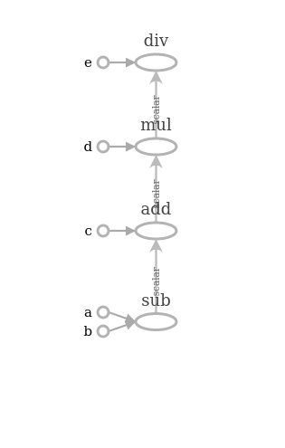

# First Look at TensorFlow

# Inhoud

1. [Wat is Tensorflow?](#wat_is_tensorflow)
2. [Computational Graphs](#computational_graphs)
    1. [Waarom Computational Graphs?](#waarom_computational_graphs)
    2. [Neurale netwerken als Computational Graphs](#neural_networks_as_computational_graphs)
3. [Tensorflow - voorbeelden](#voorbeelden_tensorflow)
    1. [Voorbeeld 1: Tensorflow - Scalar Constants](#voorbeeld1_scalar_constants)
    2. [Voorbeeld 2: Tensorflow - Scalar Placeholders](#voorbeeld2_scalar_placeholders)
    3. [Voorbeeld 3: Tensorflow - Scalar Variables & Scalar Placeholders](#voorbeeld3_scalar_variables_placeholders)
    4. [Voorbeeld 4: Tensorflow - Vector Constants](#voorbeeld4_vector_constants)
    5. [Voorbeeld 5: Tensorflow - Vector/Matrix/Tensor Operations](#voorbeeld5_vector_matrix_operations)
    6. [Voorbeeld 6: Tensorflow - Neurale Netwerken](#voorbeeld6_neuraal_netwerk)

<a name="wat_is_tensorflow"></a> 

# Wat is Tensorflow?

TensorFlow is wiskundige software en een open-source softwarebibliotheek voor Machine Intelligence, ontwikkeld in 2011 door Google Brain Team. Het oorspronkelijke doel van TensorFlow was onderzoek te doen naar machine learning en deep neural networks. Het systeem is echter algemeen genoeg om ook in een groot aantal andere domeinen te kunnen worden toegepast.

De naam is afgeleid van het gegevensmodel dat wordt vertegenwoordigd door *tensors* en de *data flow graph*, die het uitvoeringsmodel van de TensorFlow voorstelt.

Een **tensor** is een multidimensionale reeks getallen, eenvoudig een conceptuele uitbreiding van een matrix/vector tot een willekeurig aantal dimensies.

<a name="computational_graphs"></a> 

# Computational Graphs

Bij het uitvoeren van een operatie, zoals bijvoorbeeld het trainen van een neuraal netwerk of het berekenen van de som van twee gehele getallen, stelt TensorFlow intern zijn berekening voor met behulp van een data flow graph of computational graph.

Dit is een grafiek die bestaat uit het volgende:
* een set knooppunten, die elk een bewerking vertegenwoordigen;
* een reeks pijlen, die elk de gegevens vertegenwoordigen waarop de bewerkingen worden uitgevoerd.

Een computational graph is eigenlijk een flow chart; het volgende voorbeeld in **figuur 1** is de berekeningsgrafiek voor een eenvoudige berekening: z = d x c = (a + b) x c.


Figuur 1: een voorbeeld van een eenvoudige graph

In figuur 1 geven de cirkels in de grafiek de bewerkingen aan, terwijl de rechthoeken de computational graph aangeven.

<a name="waarom_computational_graphs"></a> 

## Waarom Computational Graphs?

Een ander belangrijk idee in TensorFlow is de uitgestelde uitvoering. Tijdens de bouwfase van de computational graph kunt u zeer complexe expressies samenstellen wanneer u ze tijdens de lopende sessiefase wilt evalueren. TensorFlow plant de uitvoering op de meest efficiënte manier (bijvoorbeeld, parallelle uitvoering van onafhankelijke delen van de code met behulp van de GPU).

Op deze manier helpt een grafiek om de rekenbelasting te verdelen als men te maken heeft met complexe modellen, die een groot aantal knooppunten en lagen bevatten. 

Uiteindelijk kan een neuraal netwerk worden vergeleken met een samengestelde functie, waarbij elke netwerklaag kan worden weergegeven als een functie.

<a name="neural_networks_as_computational_graphs"></a> 

## Neurale netwerken als Computational Graphs

Het is handig om een neuraal netwerk voor te stellen als een Computational Graph (computergrafiek), dat wil zeggen, in termen van gegevens die door het netwerk stromen.


Figuur 2: het neurale netwerk voorgesteld als Computational Graph

Hier geeft L3 de output layer aan, L2 de hidden layer en L1 de input layer. Op dezelfde manier geeft Ɵ2 de gewichtsvector aan tussen laag 2 en laag 3. Ɵ1 geeft de gewichtsvector tussen aan laag 1 en laag 2. De δ notatie verwijst naar de sigmoïde bewerking die plaatsvindt binnen die knooppunten.

In deze voorstelling vertegenwoordigt elk knooppunt geen enkelvoudig neuron, maar eerder een operatie, terwijl de pijlen geen verbindingen zijn, maar de informatiestroom doorheen het netwerk vertegenwoordigen. De functie van layer L2 werkt op twee ingangen: de uitgangen van layer L1 (een vector) en de gewichtsvector Ɵ1, terwijl de functie van L2 en L3 op werkt op Ɵ2 en dit is onze uiteindelijke output.

<a name="voorbeelden_tensorflow"></a> 

# Tensorflow - voorbeelden

In dit gedeelte wordt Tensorflow in Python toegelicht a.d.h.v. enkele eenvoudige voorbeelden.

De algemene werkwijze in het gebruik van Tensorflow is als volgt:

1. Definieer het netwerk of het model met behulp van wiskundige uitdrukkingen, die een computergrafiek definiëren.
2. Gebruik de automatische differentiatiemogelijkheden van Tensorflow om de gradiënten te berekenen.
3. Gebruik Stochastic Gradient Descent (SGD) in het model.

Computational Graphs of computergrafieken, gedefinieerd in Tensorflow, worden uitgevoerd in sessies (Sessions). Er wordt gestart met een eenvoudig voorbeeld (zie voorbeeld 1).

<a name="voorbeeld1_scalar_constants"></a> 

## Voorbeeld 1 - TensorFlow - Scalar Constants

Let even op volgende aandachtspunten:

1. Expressies kunnen worden gedefinieerd met vooraf gedefinieerde constanten.
2. Elke constante moet een naam krijgen (naast de naam van de variabele) om een ​​goede geannoteerde grafiek in Tensorboard te krijgen.
3. De computergrafiek, die is gedefinieerd als resultaat van de wiskundige functie, moet in een sessie worden uitgevoerd.
4. Er moet een samenvattend writer object worden gemaakt om gegevens naar Tensorboard te verzenden.
5. We kunnen de methode add_graph gebruiken om de computergrafiek door te geven aan Tensorboard voor visualisatie.
6. Het definiëren van de uitdrukking verschilt van het uitvoeren ervan (met session.run).

```python 
# Voorbeeld 1: Tensorflow in Python - Scalar Constants
import tensorflow as tf

a = tf.constant(1.0,name='a')
b = tf.constant(2.0,name='b')
c = tf.constant(3.0,name='c')
d = tf.constant(4.0,name='d')
e = tf.constant(5.0,name='e')

f = ((a-b+c)*d)/e

session = tf.compat.v1.Session()
writer = tf.compat.v1.summary.FileWriter("./temp/tensorflow1")
writer.add_graph(session.graph)

print ("Expected: ((1-2+3)*4)/5.0 = ",((1-2+3)*4/5.0))
print ("Via Tensorflow: ((1-2+3)*4)/5.0 = ",session.run(f) )

# Expected: ((1-2+3)*4)/5.0 = 1.6
# Via Tensorflow: ((1-2+3)*4)/5.0 = 1.6
```

In dit voorbeeld worden de **constanten** als volgt gedefinieerd: a = 1.0, b = 2.0, c = 3.0, d = 4.0 en e = 5.0.
De wiskundige functie die via Tensorflow wordt berekend wordt weergegeven in parameter f = ((a - b + c) * d)/e

Met het writer object 'writer' worden de resultaten weggeschreven in de map 'temp', onder de subdirectory 'tensorflow1'.
Met de linux opdracht `tensorboard --logdir=tensorflow1' wordt de visuele voorstelling van de bewerkingen gegenereerd.

Via Tensorboard wordt volgende visuele voorstelling van voorbeeld 1 gegenereerd (zie **figuur 3**): 



Figuur 3: Tensorboard visualisatie van voorbeeld 1

<a name="voorbeeld2_scalar_placeholders"></a> 

## Voorbeeld 2 - TensorFlow - Scalar Placeholders

Een **placeholder** in Tensorflow is een variabele waarvan de waarde tijdens runtime wordt gedefinieerd door de gebruiker.

Let even op volgende aandachtspunten:

1. Het datatype van de placeholder wordt gedefinieerd bij de declaratie (bijvoorbeeld: *tf.float32*).
2. Er moet een naam worden gegeven aan placeholders zodat ze correct kunnen worden geannoteerd in de computergrafiek (via Tensorboard).
3. Expressies kunnen worden gedefinieerd met placeholders die vergelijkbaar zijn met constanten.
4. De waarden van de placeholders worden verstrekt wanneer een computergrafiek, die overeenkomt met een expressie, wordt uitgevoerd (met session.run) door ze te definiëren via een woordenboek (dictionary) met de naam *feed_dict*.

```python 
# Voorbeeld 2: Tensorflow in Python - Scalar Placeholders
import tensorflow as tf

a = tf.compat.v1.placeholder(tf.float32,name='a')
b = tf.compat.v1.placeholder(tf.float32,name='b')
c = tf.compat.v1.placeholder(tf.float32,name='c')
d = tf.compat.v1.placeholder(tf.float32,name='d')
e = tf.compat.v1.placeholder(tf.float32,name='e')

f = ((a-b+c)*d)/e

session = tf.compat.v1.Session()
writer = tf.compat.v1.summary.FileWriter("./temp/tensorflow2")
writer.add_graph(session.graph)

print ("Expected: ((1-2+3)*4)/5.0 = ",((1-2+3)*4/5.0))
print ("Via Tensorflow: ((1-2+3)*4)/5.0 = ",session.run(f,feed_dict={a:1,b:2,c:3,d:4,e:5}) )

# Expected: ((1-2+3)*4)/5.0 = 1.6
# Via Tensorflow: ((1-2+3)*4)/5.0 = 1.6
```

In dit voorbeeld worden de **placeholders** voor a, b, c, d en e (datatype *tf.float32*) gedefinieerd.
De wiskundige functie die via Tensorflow wordt berekend wordt weergegeven in parameter f = ((a - b + c) * d)/e

Met het writer object 'writer' worden de resultaten weggeschreven in de map 'temp', onder de subdirectory 'tensorflow2'.
Met de linux opdracht `tensorboard --logdir=tensorflow2' wordt de visuele voorstelling van de bewerkingen gegenereerd.

Via Tensorboard wordt volgende visuele voorstelling van voorbeeld 2 gegenereerd (zie **figuur 4**): 


Figuur 4: Tensorboard visualisatie van voorbeeld 2

<a name="voorbeeld3_scalar_variables_placeholders"></a> 

## Voorbeeld 3 - TensorFlow - Scalar Variables & Scalar Placeholders

Een **variabele** wordt gedefinieerd bij de declaratie en vervolgens bijgewerkt tijdens runtime. Meestal worden variabelen gebruikt om de parameters/gewichten van het model weer te geven.

Let even op volgende aandachtspunten:

1. De initiële waarde van de variabele wordt gedefinieerd bij de declaratie.
2. Er moet een naam worden gegeven aan variabelen om ze correct te kunnen annoteren in de computergrafiek (via Tensorboard).
3. Expressies kunnen worden gedefinieerd met variabelen, die vergelijkbaar zijn met constanten en placeholders.
4. Tijdens de uitvoering van de computergrafiek worden de waarden van de variabelen ingesteld (zoals gedefinieerd) door de methode *global_variables_initialiser* aan te roepen.
5. Computergrafieken kunnen een mix zijn van variabelen, constanten en placeholders.

```python 
# Voorbeeld 3: Tensorflow in Python - Scalar Variables & Scalar Placeholders
import tensorflow as tf

a = tf.compat.v1.placeholder(tf.float32,name='a')
b = tf.compat.v1.placeholder(tf.float32,name='b')
c = tf.compat.v1.Variable(initial_value=3.0,name='c')
d = tf.compat.v1.Variable(initial_value=4.0,name='d')
e = tf.constant(5.0,name='e')

f = ((a-b+c)*d)/e

session = tf.compat.v1.Session()
writer = tf.compat.v1.summary.FileWriter("./temp/tensorflow3")
writer.add_graph(session.graph)

print ("Expected: ((1-2+3)*4)/5.0 = ",((1-2+3)*4/5.0))
session.run(tf.compat.v1.global_variables_initializer())
print ("Via Tensorflow: ((1-2+3)*4)/5.0 = ",session.run(f,feed_dict={a:1,b:2}) )

# Expected: ((1-2+3)*4)/5.0 = 1.6
# Via Tensorflow: ((1-2+3)*4)/5.0 = 1.6
```

In dit voorbeeld worden de **placeholders** voor de variabelen a en b (datatype *tf.float32*), de **variabelen** voor c en d en de **constante** e gedefinieerd.
De wiskundige functie die via Tensorflow wordt berekend wordt weergegeven in parameter f = ((a - b + c) * d)/e

Met het writer object 'writer' worden de resultaten weggeschreven in de map 'temp', onder de subdirectory 'tensorflow3'.
Met de linux opdracht `tensorboard --logdir=tensorflow3' wordt de visuele voorstelling van de bewerkingen gegenereerd.

Via Tensorboard wordt volgende visuele voorstelling van voorbeeld 3 gegenereerd (zie **figuur 5**): 


Figuur 5: Tensorboard visualisatie van voorbeeld 3

<a name="voorbeeld4_vector_constants"></a> 

## Voorbeeld 4 - TensorFlow - Vector Constants

In Tensorflow is het ook mogelijk om met Python **Numpy arrays** te rekenen. Omdat een tensor een multidimensionale reeks getallen is, dient altijd rekening gehouden te worden
met de dimensies van de vectoren, matrices en tensors.

Let even op volgende aandachtspunten:

1. Tensors kunnen worden geïnitialiseerd met Numpy-arrays.
2. Er moet een naam worden gegeven aan constanten om ze correct te kunnen annoteren in de computergrafiek.
3. Tensor/matrix/vector bewerkingen moeten de dimensies respecteren. Fouten worden gedetecteerd wanneer de computergrafiek wordt uitgevoerd in de sessie, waardoor debuggen een  beetje lastig is.

```python 
# Voorbeeld 4: Tensorflow in Python - Vector Constants
import numpy as np
import tensorflow as tf

a_data = np.array([[1,1],[1,1]])
b_data = np.array([[2,2],[2,2]])
c_data = np.array([[5,5],[5,5]])
d_data = np.array([[3,3],[3,3]])

a = tf.constant([[1,1],[1,1]],name='a')
b = tf.constant([[2,2],[2,2]],name='b')
c = tf.constant([[5,5],[5,5]],name='c')
d = tf.constant([[3,3],[3,3]],name='d')

e = (a+b-c)*d

session = tf.compat.v1.Session()
writer = tf.compat.v1.summary.FileWriter("./temp/tensorflow4")
writer.add_graph(session.graph)

print ("Expected: ",(a_data+b_data-c_data)*d_data)
print ("Via Tensorflow: ",session.run(e))

# Expected: [-6 -6]
# Via Tensorflow: [-6 -6]
```

In dit voorbeeld worden de **Numpy arrays** a_data, b_data, c_data, d_data, evenals de Tensorflow **vector constants** a, b, c en d gedefinieerd.
De wiskundige functie die via Tensorflow wordt berekend wordt weergegeven in parameter e = (a + b - c)/d

Met het writer object 'writer' worden de resultaten weggeschreven in de map 'temp', onder de subdirectory 'tensorflow4'.
Met de linux opdracht `tensorboard --logdir=tensorflow4' wordt de visuele voorstelling van de bewerkingen gegenereerd.

Via Tensorboard wordt volgende visuele voorstelling van voorbeeld 4 gegenereerd (zie **figuur 6**): 


Figuur 6: Tensorboard visualisatie van voorbeeld 4

<a name="voorbeeld5_vector_matrix_operations"></a> 

## Voorbeeld 5 - TensorFlow - Vector/Matrix/Tensor Operations

In dit voorbeeld wordt aangetoond hoe in Tensorflow bewerkingen met vectoren/matrices/tensors worden uitgevoerd.

```python 
# Voorbeeld 5: Tensorflow in Python - Vector/Matrix Operations
import numpy as np
import tensorflow as tf

# Construct from diagonal
a = tf.linalg.tensor_diag([1.0,1.0,1.0],name="a")
print("Matrix a = ",a)

# Random Normalised Matrix
b = tf.random.truncated_normal([3,3], name="b")
print("Matrix b = ",b)

# Simple Fill
c = tf.fill([3,4],-1.0,name = "c")
print("Matrix c = ",c)

# Uniform Random
d = tf.random.uniform([3,3], name="d")
print ("Matrix d = ",d)

# Addition
f = tf.add(a,b,name="f")
print("Matrix f = ",f)

# Subtraction
g = tf.subtract(a,b,name="g")
print("Matrix g = ",g)

# Multiplication
h = tf.matmul(a,b,name = "h")
print("Matrix h = ",h)

# Transpose
i = tf.transpose(a,name="i")
print("Matrix i = ",i)

# Determinant
j = tf.linalg.det(d,name="j")
print("Determinant j = ",j)

# Inverse
k = tf.linalg.inv(d, name = "k")
print("Inverse matrix k = ",k)

session = tf.compat.v1.Session()
writer = tf.compat.v1.summary.FileWriter("./temp/tensorflow5")
writer.add_graph(session.graph)
```

In dit voorbeeld wordt enkele matrixbewerkingen binnen Tensorflow gedemonstreerd, zoals het bepalen van de som, het verschil en het product van matrices, maar ook het bepalen van de getransponeerde, de determinant of het inverse van een matrix.

Met het writer object 'writer' worden de resultaten weggeschreven in de map 'temp', onder de subdirectory 'tensorflow5'.
Met de linux opdracht `tensorboard --logdir=tensorflow5' wordt de visuele voorstelling van de bewerkingen gegenereerd.

Via Tensorboard wordt volgende visuele voorstelling van voorbeeld 5 gegenereerd (zie **figuur 7**): 


Figuur 7: Tensorboard visualisatie van voorbeeld 5

<a name="voorbeeld6_neuraal_netwerk"></a> 

## Voorbeeld 6 - TensorFlow - Neuraal Netwerk

In dit voorbeeld wordt aangetoond hoe een neuraal netwerk met twee lagen in Tensorflow opgebouwd en getraind wordt.

Let even op volgende aandachtspunten:

1. We gebruiken de ReLU activeringsfunctie (*tf.nn.relu*) en het kwadratisch verschil (*tf.square*) om de fout te bepalen.
2. Het neurale netwerkmodel wordt gedefinieerd met de input en output als **placeholder** en het gewicht en de bias termen als **variabelen**.
3. De gewichten en bias termen van het neurale netwerk worden geïnitialiseerd met random_normal (*tf.random.normal*).
4. We gebruiken het GradientDescentOptimizer object (*tf.train.GradientDescentOptimizer*) om de verliesfunctie te minimaliseren.
5. De trainingsstap (*train_step*) wordt aangeroepen voor een specifiek aantal **epochs** (5000), waarin gradiënten worden berekend en de gewichtsvectoren worden bijgewerkt.
6. Gegevens worden doorgegeven via de parameter *feed_dict* van de *session.run* methode, voor elke aanroep van de trainingsstap (*train_step*).

```python 
# Voorbeeld 6: Tensorflow in Python - Neural Network
import numpy as np
import tensorflow as tf

# Generate Random Data
examples = 1000
features = 100
x_data = np.random.randn(examples,features)
y_data = np.random.randn(examples,1)

# Define the Neural Network Model
hidden_layer_nodes = 10
X = tf.compat.v1.placeholder(tf.float32,shape=[None,features],name="X")
y = tf.compat.v1.placeholder(tf.float32,shape=[None,1],name = "Y")

# Layer 1
w1 = tf.compat.v1.Variable(tf.random.normal(shape=[features,hidden_layer_nodes]),name="w1")
b1 = tf.compat.v1.Variable(tf.random.normal(shape=[hidden_layer_nodes]),name="b1")

# Layer 2
w2 = tf.compat.v1.Variable(tf.random.normal(shape=[hidden_layer_nodes,1]),name="w2")
b2 = tf.compat.v1.Variable(tf.random.normal(shape=[1,1]),name="b2")
hidden_output=tf.nn.relu(tf.add(tf.matmul(X,w1),b1),name="hidden_output")
y_hat = tf.nn.relu(tf.add(tf.matmul(hidden_output,w2),b2), name="y_hat")
loss=tf.reduce_mean(tf.square(y_hat-y),name="loss")

# Set up the gradient descent
learning_rate = 0.05
optimiser = tf.train.GradientDescentOptimizer(learning_rate)
train_step = optimiser.minimize(loss)

session = tf.compat.v1.Session()
writer = tf.compat.v1.summary.FileWriter("./temp/neural_network1")
writer.add_graph(session.graph)
session.run(tf.compat.v1.global_variables_initializer())

epochs = 5000
batch_size = 5

# Before training
curr_loss = session.run(loss,feed_dict={X:x_data,y:y_data})
print("Loss before training: ",curr_loss)

for i in range(epochs):
	rand_index = np.random.choice(examples,size=batch_size)	 
	session.run(train_step,feed_dict={X:x_data[rand_index],y:y_data[rand_index]})

# After training
curr_loss = session.run(loss,feed_dict={X:x_data,y:y_data})
print("Loss after training: ",curr_loss)

# Voorbeeld van een simulatie:
# ---------------------------
# Loss before training: 42.431
# Loss after training: 0.976375
```

In dit voorbeeld wordt een neuraal netwerk met twee lagen opgebouwd en getraind. De ReLU activeringsfunctie en het kwadratisch verschil om de de fout te bepalen worden toegepast. Het neurale netwerk wordt gedurende 5000 epochs getraind en de batch-grootte (*batch_size*) in dit voorbeeld is 5.

Met het writer object 'writer' worden de resultaten weggeschreven in de map 'temp', onder de subdirectory 'neural_network1'.
Met de linux opdracht `tensorboard --logdir=neural_network1' wordt de visuele voorstelling van de bewerkingen gegenereerd.

Via Tensorboard wordt volgende visuele voorstelling van voorbeeld 6 gegenereerd (zie **figuur 8**): 


Figuur 8: Tensorboard visualisatie van voorbeeld 6


