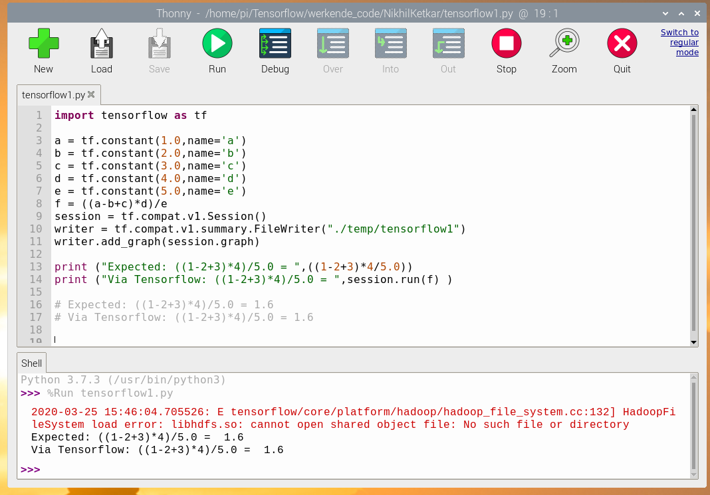
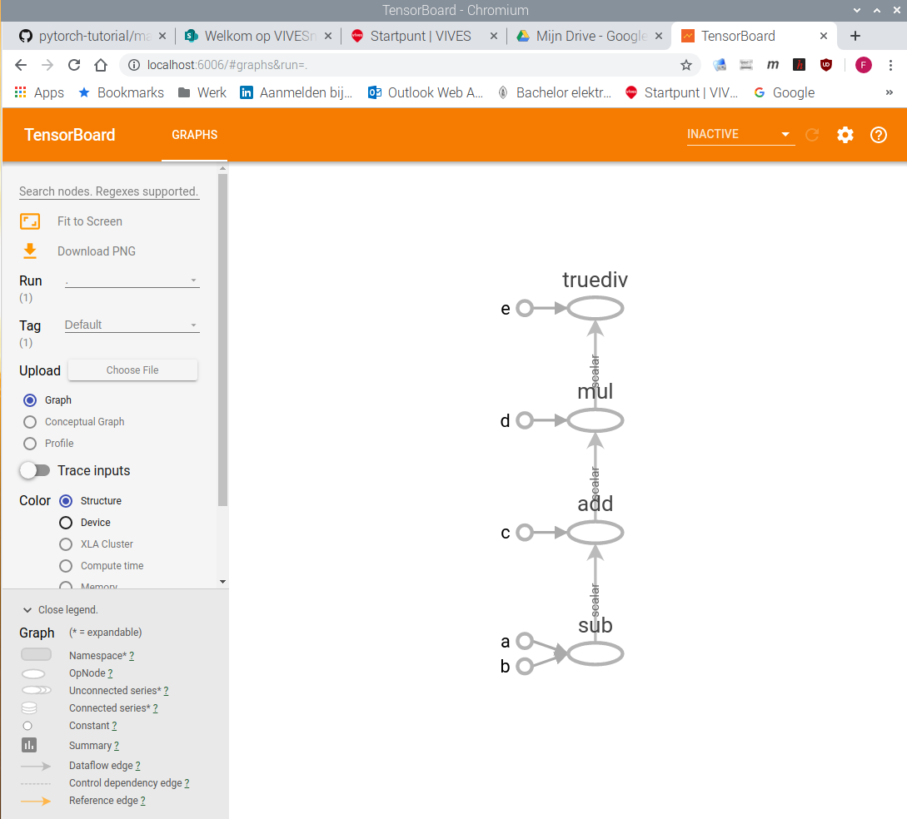

# Tensorflow_on_RPi4

# Inhoud

1. [Installeren van Tensorflow op Raspberry Pi 4](#tensorflow_rpi4)
2. [Voorbeeld van een Tensorflow programma](#tensorflow_programma)
3. [Testen van de Tensorflow code op de RPi4](#testen_code)
4. [Visualisatie van de Tensorflow code via Tensorboard](#tensorboard)

<a name="tensorflow_rpi4"></a> 

# Installeren van Tensorflow op Raspberry Pi 4

Om Tensorflow en Tensorboard op de Raspberry Pi 4 te installeren, worden volgende commando's vanuit de terminal uitgevoerd:

1. Update alle RPi4 packages:
```linux
sudo apt update
```

2. Installeer Python 3:
```linux
sudo apt install python3-dev python3-pip
```

3. Installeer libatlas-base-dev:
```linux
sudo install -y libatlas-base-dev
```

4. Installeer Tensorflow:
```linux
pip3 install --user --upgrade tensorflow
```

5. Installeer Tensorboard via Torch:
```linux
sudo pip install torch
```
<a name="tensorflow_programma"></a>

# Voorbeeld van een Tensorflow programma

```python 
# Voorbeeld 1: Tensorflow in Python - Scalar Constants
import tensorflow as tf

a = tf.constant(1.0,name='a')
b = tf.constant(2.0,name='b')
c = tf.constant(3.0,name='c')
d = tf.constant(4.0,name='d')
e = tf.constant(5.0,name='e')

f = ((a-b+c)*d)/e

session = tf.compat.v1.Session()
writer = tf.compat.v1.summary.FileWriter("./temp/tensorflow1")
writer.add_graph(session.graph)

print ("Expected: ((1-2+3)*4)/5.0 = ",((1-2+3)*4/5.0))
print ("Via Tensorflow: ((1-2+3)*4)/5.0 = ",session.run(f) )

# Expected: ((1-2+3)*4)/5.0 = 1.6
# Via Tensorflow: ((1-2+3)*4)/5.0 = 1.6
```

In dit voorbeeld worden de Tensorflow **constanten** als volgt gedefinieerd: a = 1.0, b = 2.0, c = 3.0, d = 4.0 en e = 5.0.
De wiskundige functie die via Tensorflow wordt berekend wordt weergegeven in parameter f = ((a - b + c) * d)/e


<a name="testen_code"></a> 

# Testen van de Tensorflow code op de RPi4

De Tensorflow code wordt uitgevoerd in Python.
Het resultaat wordt weergegeven in figuur 1.



Figuur 1: uitvoeren van de Tensorflow code

De *HadoopFileSystem error* mag worden genegeerd. Bemerk dat de berekening van f via Python en via Tensorflow correct wordt uitgevoerd (resultaat = 1.6).

<a name="tensorboard"></a> 

# Visualisatie van de Tensorflow code via Tensorboard

Met het writer object 'writer' worden de resultaten weggeschreven in de map 'temp', onder de subdirectory 'tensorflow1'.
Met de linux opdracht `tensorboard --logdir=tensorflow1' wordt de visuele voorstelling van de bewerkingen gegenereerd.

Via de browser (URL: localhost:6006/) wordt volgende visuele voorstelling van de Tensorflow code gegenereerd (zie **figuur 2**): 



Figuur 2: Tensorboard visualisatie

